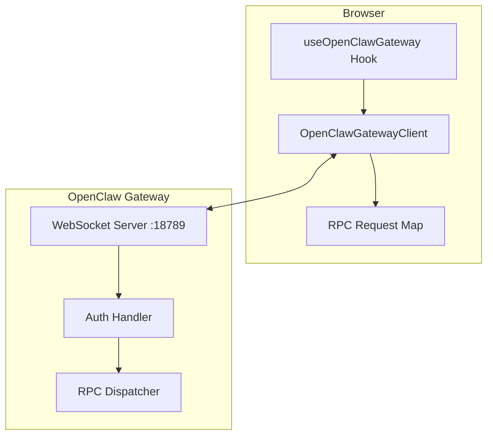
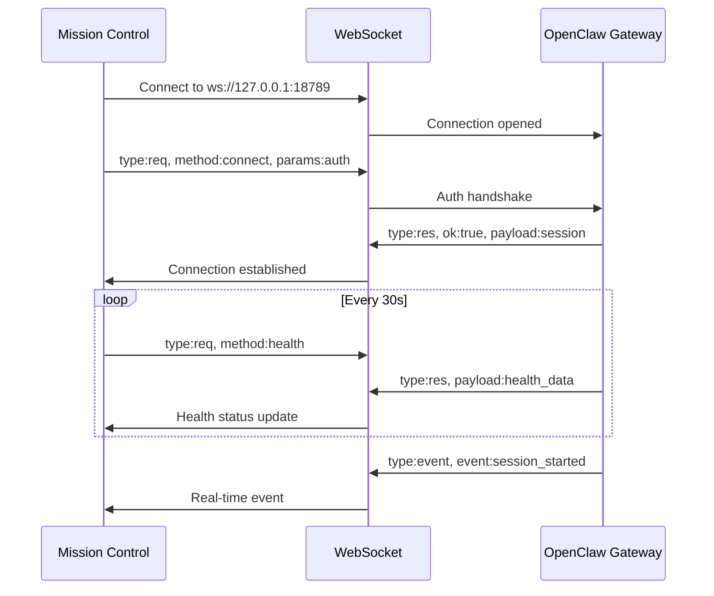
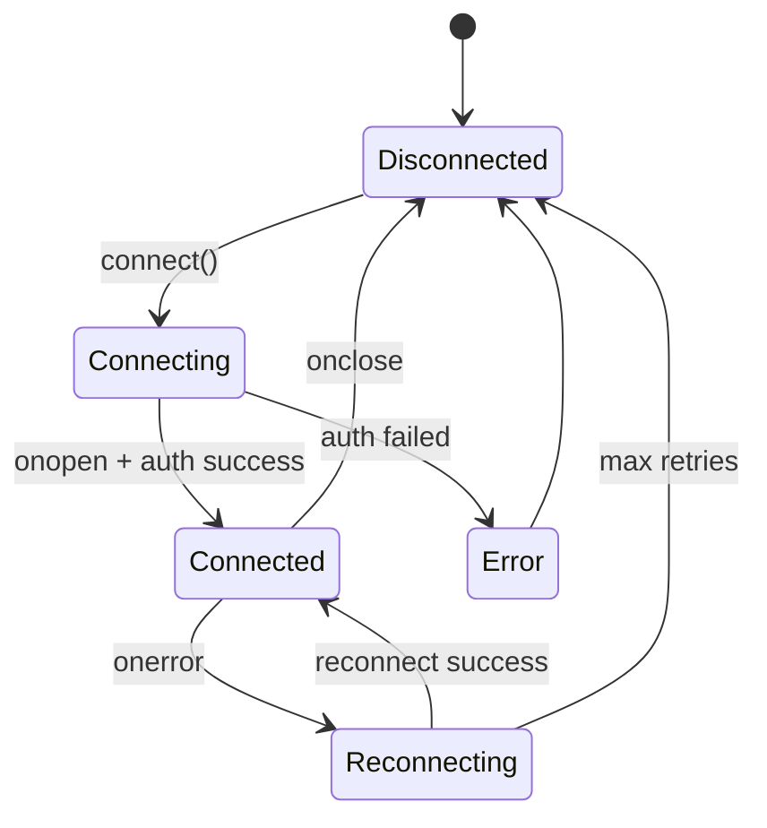
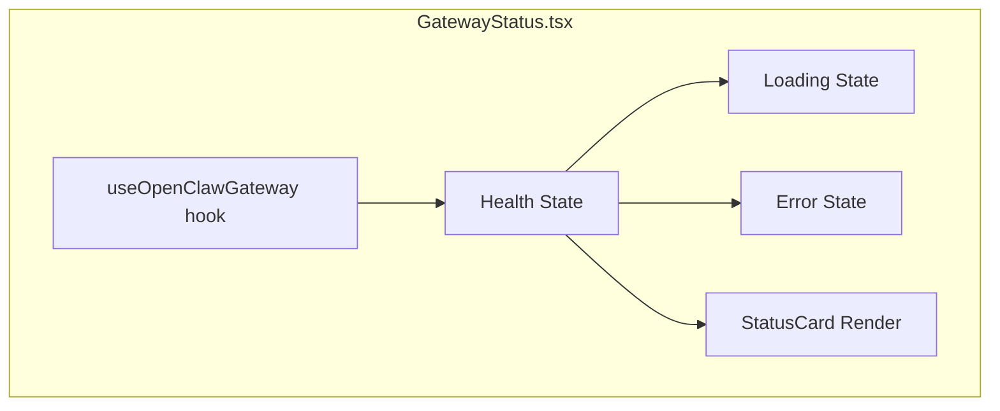
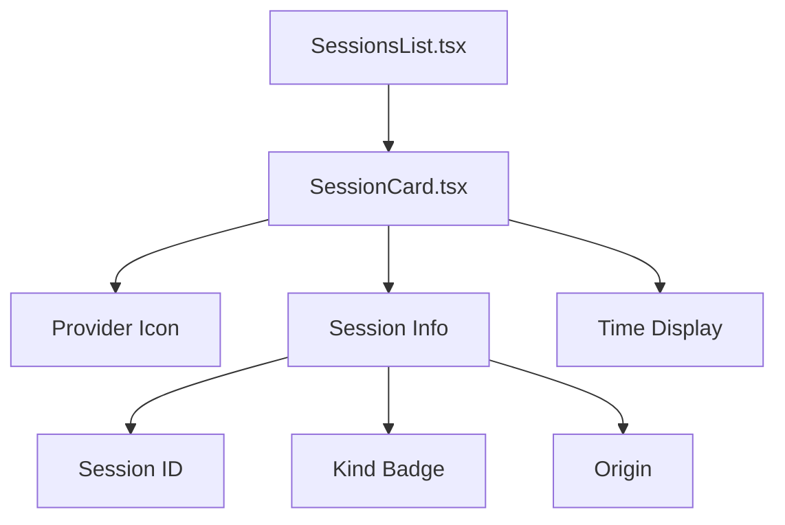
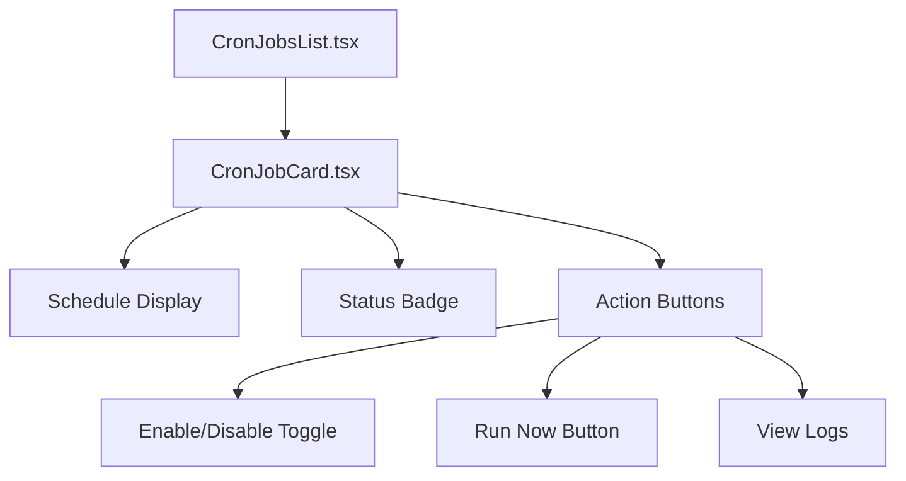
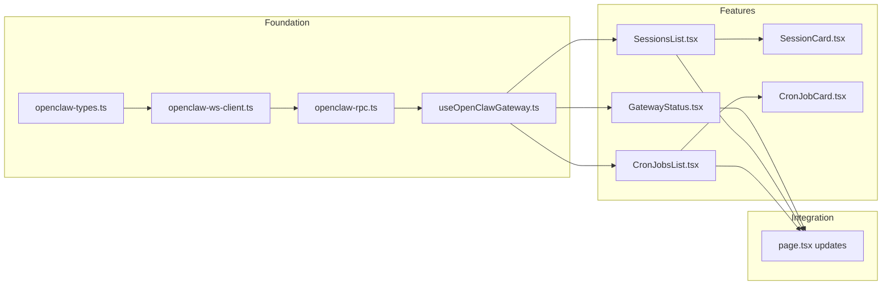

# Mission Control Phase 1: WebSocket Integration Implementation Plan

## Overview

This plan details the implementation of WebSocket-based real-time data integration between Mission Control dashboard and OpenClaw Gateway. The goal is to replace static CLI-based data fetching with dynamic WebSocket RPC calls.

## Current State Analysis

### Existing Architecture
- **Data Source**: CLI commands (`openclaw`, `qmd`) executed via API routes
- **Refresh Mechanism**: Polling every 30 seconds via `useEffect` in [`app/page.tsx`](app/page.tsx:65-72)
- **Types**: Defined in [`lib/types.ts`](lib/types.ts)
- **Components**: StatusCard, RunningAgents, CronResults, RecentErrors, QuickActions

### Key Files to Modify/Create
| File | Action | Purpose |
|------|--------|---------|
| `lib/openclaw-ws-client.ts` | Create | WebSocket client class |
| `lib/openclaw-rpc.ts` | Create | RPC call wrapper |
| `lib/openclaw-types.ts` | Create | Gateway message types |
| `hooks/useOpenClawGateway.ts` | Create | React hook for WebSocket |
| `lib/types.ts` | Modify | Add WebSocket-related types |
| `components/GatewayStatus.tsx` | Create | New dynamic gateway card |
| `components/SessionsList.tsx` | Create | Active sessions panel |
| `components/SessionCard.tsx` | Create | Individual session card |
| `components/CronJobsList.tsx` | Create | Cron jobs management panel |
| `components/CronJobCard.tsx` | Create | Individual cron job card |
| `app/page.tsx` | Modify | Integrate WebSocket hook |

---

## Feature 1: WebSocket Gateway Client

### Architecture Diagram



### Message Flow



### Implementation Details

#### 1.1 TypeScript Types - `lib/openclaw-types.ts`

```typescript
// Gateway message types
export interface GatewayRequest {
  type: 'req';
  id: number;
  method: string;
  params?: Record<string, unknown>;
}

export interface GatewayResponse {
  type: 'res';
  id: number;
  ok: boolean;
  payload?: unknown;
  error?: GatewayError;
}

export interface GatewayEvent {
  type: 'event';
  event: string;
  payload: unknown;
}

export interface GatewayError {
  code: string;
  message: string;
  details?: unknown;
}

// Connection types
export interface ConnectionParams {
  role: 'operator';
  scopes: ['operator.read', 'operator.write'];
  auth: { token: string };
  client: {
    id: 'mission-control';
    version: string;
    platform: 'web';
    mode: 'operator';
  };
}

// Health response types
export interface HealthResponse {
  ok: boolean;
  runtime: {
    state: 'running' | 'stopped';
    pid: number;
    bindMode: string;
    listening: string;
  };
  channels: Record<string, { running: boolean; lastProbe?: string }>;
  agents: Array<{ id: string; name: string }>;
  heartbeatSeconds: number;
}

// Session types
export interface GatewaySession {
  sessionId: string;
  kind: 'direct' | 'group';
  origin: {
    channel: string;
    provider: string;
  };
  updatedAt: string;
  agent?: boolean;
}

// Cron types
export interface GatewayCronJob {
  id: string;
  name: string;
  type: 'systemEvent' | 'agentTurn';
  schedule: {
    kind: 'cron' | 'every' | 'at';
    expr?: string;
    everyMs?: number;
    at?: string;
  };
  enabled: boolean;
  running: boolean;
  nextRun?: string;
  lastRun?: {
    status: 'ok' | 'error';
    at: string;
    error?: string;
  };
  agent?: {
    id: string;
    name: string;
  };
}
```

#### 1.2 WebSocket Client - `lib/openclaw-ws-client.ts`

**Key Features:**
- Singleton pattern for single connection
- Auto-reconnect with exponential backoff (1s → 30s max)
- Request/response correlation via Map
- Event emitter pattern for real-time updates
- Graceful error handling

**State Machine:**


#### 1.3 React Hook - `hooks/useOpenClawGateway.ts`

**Hook Interface:**
```typescript
interface UseOpenClawGatewayReturn {
  client: OpenClawGatewayClient | null;
  connected: boolean;
  connecting: boolean;
  error: string | null;
  call: (method: string, params?: object) => Promise<unknown>;
}
```

**Usage Pattern:**
```typescript
const gateway = useOpenClawGateway();

// In component
useEffect(() => {
  if (!gateway.connected) return;
  
  gateway.call('health').then(setHealthData);
}, [gateway.connected]);
```

### Files to Create

| File | Lines | Description |
|------|-------|-------------|
| `lib/openclaw-types.ts` | ~100 | TypeScript interfaces |
| `lib/openclaw-ws-client.ts` | ~200 | WebSocket client class |
| `lib/openclaw-rpc.ts` | ~50 | RPC convenience wrapper |
| `hooks/useOpenClawGateway.ts` | ~80 | React hook |

---

## Feature 2: Dynamic Gateway Status

### Current vs New Implementation

| Aspect | Current (CLI) | New (WebSocket) |
|--------|---------------|-----------------|
| Data source | `openclaw gateway status` | RPC `health` method |
| Refresh | Polling 30s | Polling 30s + events |
| Fields | status, uptime, lastRestart | runtime, channels, agents, heartbeat |
| Error handling | Static error state | Real-time disconnect detection |

### Component Structure



### Data Mapping

| RPC Field | Display | Format |
|-----------|---------|--------|
| `runtime.state` | Status | running → 🟢, stopped → 🔴 |
| `runtime.pid` | PID | Direct display |
| `runtime.listening` | Port | `127.0.0.1:18789` |
| `channels.*.running` | Channel Status | ✅/❌ per channel |
| `agents.length` | Agent Count | Number |
| `heartbeatSeconds` | Heartbeat | `${value}s` |

### Implementation Checklist

- [ ] Create `components/GatewayStatus.tsx`
- [ ] Add health polling on mount + 30s interval
- [ ] Map health response to StatusCard props
- [ ] Handle loading state with skeleton
- [ ] Handle error state with retry button
- [ ] Add channel status indicators
- [ ] Test with gateway running/stopped

---

## Feature 3: Active Sessions List

### Component Hierarchy



### RPC Integration

**Method:** `sessions.list`
**Parameters:** `{ limit?: number }`
**Response:** `GatewaySession[]`

### Session Card Design

```
┌─────────────────────────────────────────────────┐
│ [📱] Session: abc123...                          │
│      Kind: Direct  │  Origin: Telegram/@user    │
│      Updated: 5 minutes ago                      │
└─────────────────────────────────────────────────┘
```

### Provider Icons Mapping

| Provider | Icon | Color |
|----------|------|-------|
| telegram | `MessageCircle` | Blue |
| discord | `Hash` | Purple |
| slack | `Slack` | Green |
| unknown | `MessageSquare` | Gray |

### Implementation Checklist

- [ ] Create `components/SessionsList.tsx`
- [ ] Create `components/SessionCard.tsx`
- [ ] Add `sessions.list` RPC call on mount
- [ ] Implement session filtering (active only)
- [ ] Add provider icon mapping
- [ ] Format timestamps with date-fns
- [ ] Add empty state component
- [ ] Add loading skeleton

---

## Feature 4: Cron Jobs List

### Component Hierarchy



### RPC Integration

| Action | Method | Parameters |
|--------|--------|------------|
| List jobs | `cron.list` | `{}` |
| Toggle job | `cron.update` | `{ id, patch: { enabled } }` |
| Run now | `cron.run` | `{ id }` |

### Schedule Formatting

```typescript
function formatSchedule(schedule: GatewayCronJob['schedule']): string {
  switch (schedule.kind) {
    case 'cron':
      return `Cron: ${schedule.expr}`;
    case 'every':
      return `Every ${schedule.everyMs / 60000}min`;
    case 'at':
      return `At: ${new Date(schedule.at).toLocaleString()}`;
    default:
      return 'Unknown schedule';
  }
}
```

### Status Badge Colors

| Status | Color | Icon |
|--------|-------|------|
| enabled + running | Green | `Loader` (spinning) |
| enabled + idle | Blue | `Check` |
| enabled + error | Red | `AlertCircle` |
| disabled | Gray | `Pause` |

### Implementation Checklist

- [ ] Create `components/CronJobsList.tsx`
- [ ] Create `components/CronJobCard.tsx`
- [ ] Add `cron.list` RPC call on mount
- [ ] Implement schedule formatting
- [ ] Add enable/disable toggle with optimistic update
- [ ] Add "Run now" button with confirmation
- [ ] Show agent target for agent jobs
- [ ] Add loading/empty states

---

## Dependency Graph



---

## Execution Order

### Phase 1.1: Foundation (WebSocket Infrastructure)
1. Create `lib/openclaw-types.ts` - All TypeScript interfaces
2. Create `lib/openclaw-ws-client.ts` - WebSocket client class
3. Create `lib/openclaw-rpc.ts` - RPC wrapper functions
4. Create `hooks/useOpenClawGateway.ts` - React hook
5. Add `OPENCLAW_GATEWAY_TOKEN` to `.env.local`

### Phase 1.2: Gateway Status
6. Create `components/GatewayStatus.tsx`
7. Update `app/page.tsx` to use new component
8. Test health polling and display

### Phase 1.3: Sessions List
9. Create `components/SessionCard.tsx`
10. Create `components/SessionsList.tsx`
11. Integrate into dashboard layout
12. Test session display and filtering

### Phase 1.4: Cron Jobs
13. Create `components/CronJobCard.tsx`
14. Create `components/CronJobsList.tsx`
15. Implement toggle/run actions
16. Integrate into dashboard
17. Test all cron operations

### Phase 1.5: Integration & Testing
18. Update main dashboard layout
19. Add connection status indicator
20. Test all features together
21. Test error states and reconnection
22. Test dark/light mode compatibility

---

## Environment Setup

### Required Environment Variables

```env
# .env.local
OPENCLAW_GATEWAY_TOKEN=your-gateway-token-here
```

### Pre-requisites Checklist
- [ ] OpenClaw gateway running (`openclaw gateway status`)
- [ ] Gateway token available
- [ ] WebSocket accessible at `ws://127.0.0.1:18789`
- [ ] Node.js 18+ installed
- [ ] Dependencies installed (`npm install`)

---

## Testing Strategy

### Manual Testing Checklist

#### WebSocket Connection
- [ ] Connect succeeds with valid token
- [ ] Connection fails gracefully with invalid token
- [ ] Auto-reconnect works after gateway restart
- [ ] Connection status indicator updates correctly

#### Gateway Status
- [ ] Health data displays correctly
- [ ] Loading state shows during fetch
- [ ] Error state shows on failure
- [ ] Auto-refresh every 30 seconds works

#### Sessions List
- [ ] Sessions populate from RPC
- [ ] Empty state shows when no sessions
- [ ] Provider icons display correctly
- [ ] Timestamps formatted correctly

#### Cron Jobs
- [ ] Jobs list populates
- [ ] Enable/disable toggle works
- [ ] Run now triggers execution
- [ ] Schedule formats correctly

### Error Scenarios to Test
- Gateway not running
- Invalid auth token
- Network disconnect during operation
- RPC method not found
- Rate limiting

---

## Risk Assessment

| Risk | Impact | Mitigation |
|------|--------|------------|
| WebSocket not supported in SSR | High | Use dynamic import, client-only rendering |
| Gateway token exposure | Medium | Server-side only, env variable |
| Connection drops frequently | Medium | Exponential backoff, visual indicator |
| RPC schema changes | Low | Type validation, fallback handling |

---

## Success Criteria

Phase 1 is complete when:
- [ ] WebSocket connects with auth handshake
- [ ] Gateway status shows real data from RPC
- [ ] Sessions list populates from `sessions.list`
- [ ] Cron jobs list populates from `cron.list`
- [ ] Enable/disable and run now actions work
- [ ] Auto-refresh works (30s interval)
- [ ] Error states display correctly
- [ ] Dark/light mode works with all new components
- [ ] Code committed to repository
